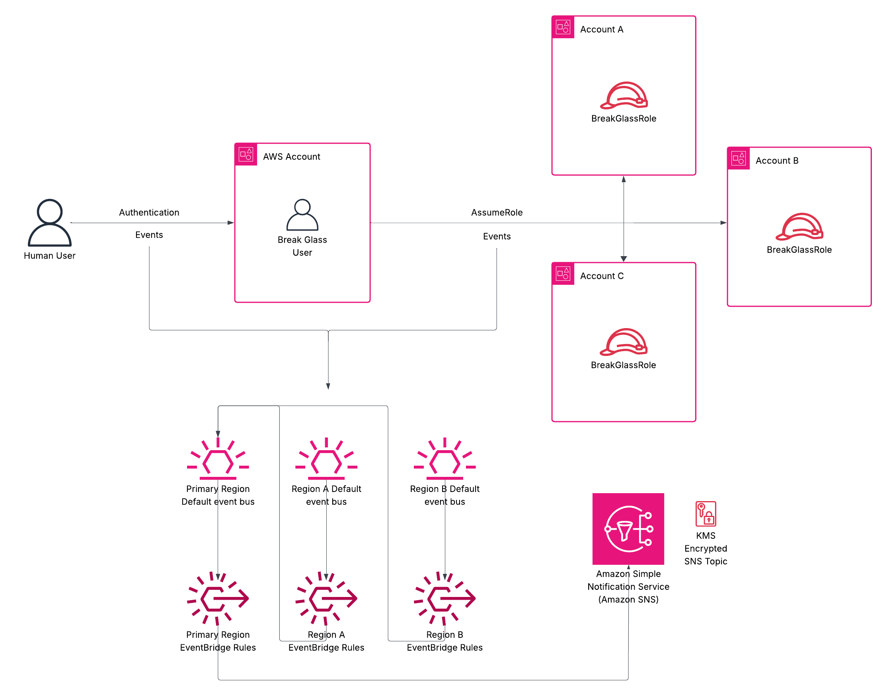

# AWS Cross-Account Break Glass Example

This repository provides a reference implementation for emergency access to AWS accounts when normal authentication methods fail. The solution creates an IAM user with cross-account role assumption capabilities and comprehensive multi-region monitoring.

:warning: **Security Warning** :warning: The break glass user uses the [IAMFullAccess](https://docs.aws.amazon.com/aws-managed-policy/latest/reference/IAMFullAccess.html) managed policy, which is NOT least privilege. Customize permissions according to your organization's security requirements.

:information_source: **Global Monitoring** :information_source: This solution provides comprehensive monitoring across all AWS regions where ConsoleLogin events can occur. Break glass activities (console logins, role switches, and role assumptions) are monitored globally and forwarded to a centralized SNS topic for unified alerting.

# Contents

1. [Introduction](#introduction)
2. [The Break Glass User](#the-break-glass-user)
3. [Solution Architecture](#solution-architecture)
4. [Deployment Instructions](#deployment-instructions)
5. [Post-Deployment Security Configuration](#post-deployment-security-configuration)
6. [References](#references)
7. [License](#license)

# Introduction

## Why Break Glass Access is Critical

Break glass access is an essential disaster recovery mechanism for AWS organizations. Named after the emergency practice of breaking glass to pull a fire alarm, it provides immediate access to AWS accounts when normal authentication systems fail.

### When You Need Break Glass Access

- Complete failure of your organization's Identity Provider (IdP)
- Security incidents compromising your IdP infrastructure
- Service outages affecting IAM Identity Center
- Misconfiguration preventing normal user access
- Permission set corruption or deletion
- Loss of entire cloud or identity management teams
- Ransomware attacks targeting identity infrastructure
- Natural disasters affecting primary authentication systems
- Critical security incidents requiring immediate administrative access

*Break glass credentials are long-term IAM user credentials with extensive privileges. Comprehensive monitoring, alerting, and strict access controls are essential to prevent misuse.*

# The Break Glass User

For organizations using [IAM Identity Center](https://aws.amazon.com/iam/identity-center/) with external Identity Providers, a dedicated break glass IAM user provides emergency access when SSO systems are unavailable.

The break glass user is deployed in a single AWS account (ideally the security account) for tight access control and monitoring. The user accesses other accounts through:

- **[SwitchRole](https://docs.aws.amazon.com/IAM/latest/UserGuide/id_roles_use_switch-role-console.html):** Once signed in as an IAM user you can switch to an IAM role
- **[AssumeRole](https://docs.aws.amazon.com/STS/latest/APIReference/API_AssumeRole.html):** Used within your account or for cross-account access

## Comprehensive Security Monitoring

Real-time alerting across **all regions where ConsoleLogin events occur** monitors:

- **Console Login Events:** Any sign-in to the AWS Console (monitored in [specific regions where AWS records these events](https://docs.aws.amazon.com/awscloudtrail/latest/userguide/cloudtrail-event-reference-aws-console-sign-in-events.html))
- **SwitchRole Events:** Role switching activities in the console
- **AssumeRole Events:** CLI/API-based role assumptions

Events are captured in all regions where AWS records ConsoleLogin events, ensuring no break glass activity goes undetected. Notifications are sent via email.

**Note:** AssumeRole and SwitchRole events can occur in any region where ConsoleLogin is possible, which is why comprehensive multi-region monitoring is essential for complete break glass activity visibility.

## Solution Architecture

This solution implements a multi-region monitoring architecture with centralized alerting, consisting of 6 key components:

- **Break Glass User:** An IAM user deployed in an account, authorized to assume Break Glass Roles in other accounts.

- **Break Glass Role:** Cross-account roles that specify the permissions granted when the Break Glass User assumes them. These roles are deployed in target accounts that require emergency access.

- **Multi-Region EventBridge Rules:** EventBridge rules deployed across all regions where ConsoleLogin events can occur to capture break glass activities:
  - **Console Login Events:** Captured in regions where AWS records these events per [AWS documentation](https://docs.aws.amazon.com/general/latest/gr/signin-service.html)
  - **SwitchRole Events:** Captured in the region where role switching occurs
  - **AssumeRole Events:** Captured in the region where CLI/API calls are made

- **Cross-Region Event Forwarding:** Secondary regions forward captured events to the primary region's default event bus using IAM roles with cross-region permissions.

- **Centralized SNS Topic:** A single SNS topic in the primary region receives all break glass notifications, encrypted with a customer-managed KMS key.

- **AWS KMS:** Customer-managed encryption key that secures the SNS topic while allowing EventBridge to publish messages.

**Event Flow:**

1. Break glass activities occur in any AWS region
2. Regional EventBridge rules capture the events
3. Secondary regions forward events to the primary region's event bus
4. Primary region's EventBridge rules route all events to the centralized SNS topic
5. SNS delivers encrypted notifications via email

This architecture ensures comprehensive monitoring regardless of which region the break glass user operates in, while maintaining centralized alerting and audit trails.

<br/>

</img>
<br/>

## Deployment Instructions

### Prerequisites

- AWS CLI configured with administrative permissions
- Terraform >= 1.0 installed
- Access to the target AWS accounts
- Email address for security notifications (recommend using a distribution list)

### Option 1: Automated Multi-Region Deployment (Recommended)

The fastest way to deploy comprehensive monitoring across all regions where ConsoleLogin events occur:

```bash
# Navigate to the break glass user directory
cd bg-user/

# Run the automated deployment script
./deploy-all-regions.sh
```

**The script will prompt you for:**

- Email address for security notifications
- Primary region (defaults to us-east-1)
- Confirmation before deployment

**What it does automatically:**

- Deploys primary monitoring infrastructure in your chosen region
- Creates SNS topic, KMS key, and break glass user
- Deploys monitoring rules in all other AWS regions
- Configures cross-region event forwarding
- Skips regions not enabled in your account
- Provides progress indicators and error handling

### Option 2: Manual Region-by-Region Deployment

**Step 1: Deploy Primary Region**

```bash
cd bg-user/
terraform init
terraform apply -var="emailAddress=security-team@company.com"
```

**Step 2: Deploy Secondary Regions**

```bash
# Example for eu-west-1
AWS_DEFAULT_REGION=eu-west-1 terraform apply \
  -var="emailAddress=security-team@company.com" \
  -var="primary_region=us-east-1" \
  -var="primary_account_id=123456789012"
```

**Step 3: Deploy Cross-Account Roles**

In each target account where break glass access is needed:

```bash
cd ../bg-role/
terraform init
terraform apply -var="AccountID=123456789012"
```

### Deployment Verification

After deployment:

1. **Check email** for SNS subscription confirmation
2. **Verify resources** in AWS Console:
   - IAM user "BreakglassUser" in management account
   - SNS topic "breakglassuser-console-logins"
   - EventBridge rules in all deployed regions
   - Cross-account roles in target accounts

### Cleanup

To remove all break glass infrastructure:

```bash
cd bg-user/
./destroy-all-regions.sh
```

The cleanup script will:

- Prompt for the email and primary region used during deployment
- Destroy resources in all secondary regions first
- Destroy primary region resources last
- Remove all Terraform workspaces

## Post-Deployment Security Configuration

**1. Enable Multi-Factor Authentication (MFA)**

The break glass user requires MFA due to its extensive privileges.

**MFA Device Security:**

- Store MFA device/software securely with limited access
- Typically managed by cloud security team members only
- Consider hardware tokens for maximum security
- Document MFA device location in incident response procedures

**2. Create and Vault the Password**

The Terraform code intentionally does not create passwords to avoid:

- Embedding credentials in code
- Storing passwords in Terraform state files

**Password Creation:**

```bash
# Create password via AWS CLI
aws iam create-login-profile \
  --user-name BreakglassUser \
  --password 'SecureRandomPassword123!' \
  --password-reset-required
```

**Password Storage Requirements:**

- Use enterprise password manager or secure vault
- Limit access to authorized personnel only
- Implement separation of duties (different people access password vs. MFA)
- Document password location in incident response procedures
- Rotate password regularly (quarterly recommended)

# References

[Amazon EventBridge](https://docs.aws.amazon.com/eventbridge/latest/userguide/eb-what-is.html)

[Amazon Simple Notification Service](https://docs.aws.amazon.com/sns/latest/dg/welcome.html)

[AWS Key Management Service](https://docs.aws.amazon.com/kms/latest/developerguide/overview.html)

[AWS Managed Policies](https://docs.aws.amazon.com/aws-managed-policy/latest/reference/about-managed-policy-reference.html)

[AWS Whitepaper: Break glass access](https://docs.aws.amazon.com/whitepapers/latest/organizing-your-aws-environment/break-glass-access.html)

[IAM Identity Center](https://aws.amazon.com/iam/identity-center/)

[Identity and Access Management](https://aws.amazon.com/iam/)

# License

This repo is licensed under the MIT-0 license.
