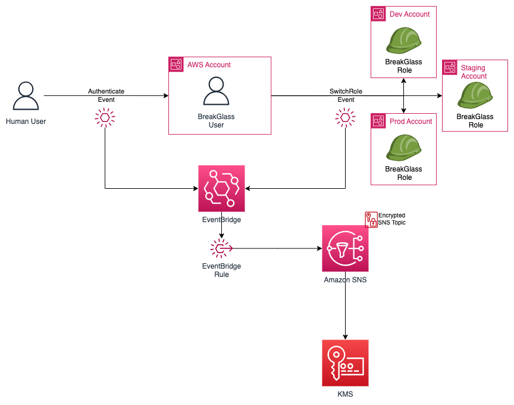

# aws-cross-account-break-glass-example
This repository contains a reference implementation for an IAM user with cross account role assumption capabilities that can be used in emergency situations.

:warning: **Warning** :warning: The break glass user in this example uses the [IAMFullAccess](https://docs.aws.amazon.com/aws-managed-policy/latest/reference/IAMFullAccess.html) managed policy which is NOT least priviledge. This can be changed according to your organizations security requirements.

📝 **_NOTE_** 📝  IAM events are Global Service Events and are captured in Cloudtrail logs in the us-east-1 region. It is important that the EventBridge code is deployed in us-east-1 in order to process the logs and send notifications successfully.
https://docs.aws.amazon.com/awscloudtrail/latest/userguide/cloudtrail-concepts.html#cloudtrail-concepts-global-service-events

# Contents
1. [Introduction](/README.md#introduction)
2. [The Break Glass User](/README.md#the-break-glass-user)
3. [Solution Architecture](/README.md#solution-architecture)
4. [Deployment Instructions](/README.md#deployment-instructions)
5. [After Deployment](/README.md#after-deployment)
6. [References](/README.md#references)
7. [License](/README.md#license)
  

# Introduction

The organization management account is often used to provide break glass access to AWS accounts within an organization. Break glass (which draws its name from breaking the glass to pull a fire alarm) refers to a quick means for a person who does not have access privileges to certain AWS accounts to gain access in exceptional circumstances by using an approved process.

The use cases for break glass access include:
- Failure of the organization’s Identity Provider (IdP).
- A security incident involving the organizations’ IdP(s).
- A failure involving IAM Identity Center.
- A disaster involving the loss of an organization’s entire cloud or IdP teams. 

*The break glass IAM user is a long term credential and is extremely important that access to these roles is monitored, and alarms and alerts are triggered when the roles are used to access the environment in order to prevent misuse.*
  

# The Break Glass User
For customers using [IAM Identity Center](https://aws.amazon.com/iam/identity-center/) for the Single Sign On (SSO) of workforce identities in AWS, an external IdP is recommended. In the unfortunated circumstance where SSO integration is unavailable, it is advised to have a *Break Glass* user created in [Identity and Access Managment](https://aws.amazon.com/iam/) (IAM). This user can be used to gain administrative access to your AWS environment during an emergency when SSO is not available.

Since the Break Glass user is only needed in case of emergency, it will be implemented in a single AWS account so that it may be tightly controlled. The Break Glass user may access other accounts through the '[SwitchRole](https://docs.aws.amazon.com/IAM/latest/UserGuide/id_roles_use.html)' mechanism. 

Alerting is enabled that provides a notification when somebody logs in as the Break Glass user or when the Break Glass user uses the SwitchRole mechanism. Notification in this example uses email for delivery, though the alert could be delivered via a different method.

## Solution Architecture

This solution is made up of 5 components:

- **Break Glass User:** An IAM user is an entity in AWS that represents a human user. The Break Glass user is deployed in the management (or security) account and is authorized to assume the Break Glass Role in other accounts using the SwitchRole mechanism.

- **Break Glass Role:** A role specifies a set of permissions that you can use to access AWS resources that you need. When the Break Glass User assumes the Break Glass Role in another account, its original permissions are temporarily set aside and it is granted the permissions specified in the Break Glass Role configured in the target account.

- **EventBridge:** [Amazon EventBridge](https://docs.aws.amazon.com/eventbridge/latest/userguide/eb-what-is.html) is a serverless service that uses events to trigger actions. In this use case, the EventBridge is used to trigger an SNS notification.

- **Amazon SNS:** [Amazon Simple Notification Service](https://docs.aws.amazon.com/sns/latest/dg/welcome.html) (SNS) is a messaging service that provides message delivery from publishers to subscribers. In this use case, EventBridge is the publisher and email is the subscriber.

- **AWS KMS** [AWS Key Management Service](https://docs.aws.amazon.com/kms/latest/developerguide/overview.html) (KMS) is an AWS managed service that allows you to create and control cryptographic keys used for encryption.

When a user in the organization logs into the management (or security) account as the Break Glass User, they are provided access assuming they have the proper credentials. This login activity creates an authentication event which is captured via EventBridge and a notification is sent via SNS.

When the Break Glass User assumes the Break Glass Role in another account (via the SwitchRole mechanism) they temporarily assume the permissions defined in the target account. The SwitchRole activity creates a Switch Role event which is captured via EventBridge and a notification is sent via SNS. The SNS topic is encrypted leveraging a KMS key.

 

</img>
 

## Deployment Instructions

- Deploy [breakglassuser.tf](./bg-user/breakglassuser.tf) into the account where the break glass user will reside. This can be deployed in the management account, though AWS recommends deploying the user in a security account or dedicated account. You will need to update the file with the email address of where the notification will be sent. We recommend using an email distribution list to ensure notification coverage.

- Deploy [breakglassrole.tf](./bg-role/breakglassrole.tf) into all other accounts. This is the role that the break glass user will assume. The role in this file assigns [IAMFullAccess](https://docs.aws.amazon.com/aws-managed-policy/latest/reference/IAMFullAccess.html) which is NOT a least priviledged policy. This can be changed according to your organizations security requirements. 

## After Deployment

- **Enable Multi Factor Authentication (MFA):** Since the Break Glass user is a highly priviledged account, [MFA should be enabled](https://docs.aws.amazon.com/IAM/latest/UserGuide/id_credentials_mfa_enable.html) to provide additional security for the account. Much like MFA for the root user, the MFA device (or software) should be secured and available to a limited set of members of your organization. Often, MFA for the Break Glass user is secured and only available to select members of the cloud security team.

- **Setup and vault the password:** The [breakglassuser.tf](./breakglassuser.tf) code purposely does not create the password for the Break Glass user. This is because 1) An IAM user password should never be embedded in code, and 2) we do not want the password logged in a statefile. After the Break Glass user account has been created, the [password will need to be created](https://docs.aws.amazon.com/IAM/latest/UserGuide/id_credentials_passwords_admin-change-user.html) by an administrator. Once the password is created, it should be vaulted in a secure location and only available to select members of your organization. Often, for separation of duties purposes, the same person is not permitted access to the Break Glass user password and the MFA device.
  

# References

[Amazon EventBridge](https://docs.aws.amazon.com/eventbridge/latest/userguide/eb-what-is.html)

[Amazon Simple Notification Service](https://docs.aws.amazon.com/sns/latest/dg/welcome.html)

[AWS Key Management Service](https://docs.aws.amazon.com/kms/latest/developerguide/overview.html)

[AWS Managed Policies](https://docs.aws.amazon.com/aws-managed-policy/latest/reference/about-managed-policy-reference.html)

[AWS Whitepaper: Break glass access](https://docs.aws.amazon.com/whitepapers/latest/organizing-your-aws-environment/break-glass-access.html)

[IAM Identity Center](https://aws.amazon.com/iam/identity-center/)

[Identity and Access Managment](https://aws.amazon.com/iam/)
  

# License
This repo is licensed under the MIT-0 license.
